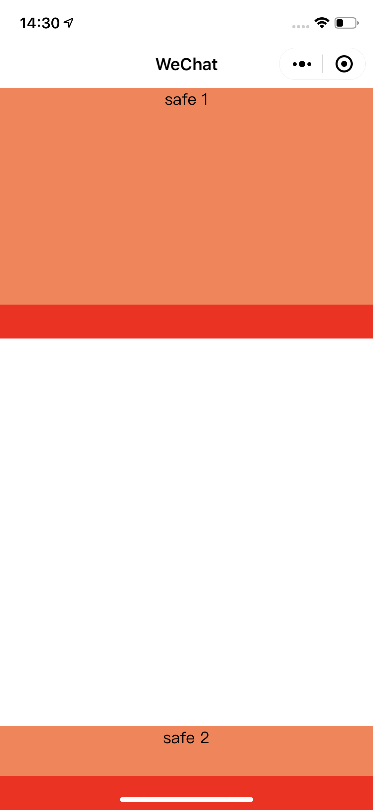

# 微信小程序 safe-view

处理 iphone 手机底部小黑条的边距问题。

## Usage

```shell script
npm install @mini-dev/safe-view
```

开启微信小程序的 npm 支持：
[https://developers.weixin.qq.com/miniprogram/dev/devtools/npm.html](https://developers.weixin.qq.com/miniprogram/dev/devtools/npm.html)


index.json

```json
{
  "usingComponents": {
    "safe-area": "@mini-dev/safe-view/safe-area",
    "safe-bottom": "@mini-dev/safe-view/safe-bottom"
  }
}
```

index.wxml

```html
<view class="container">
    <safe-area mini-class="safe-1">
        <view class="content-1">safe 1</view>
    </safe-area>
    <safe-bottom mini-class="safe-2">
        <view class="content-2">safe 2</view>
    </safe-bottom>
</view>
```

显示效果

